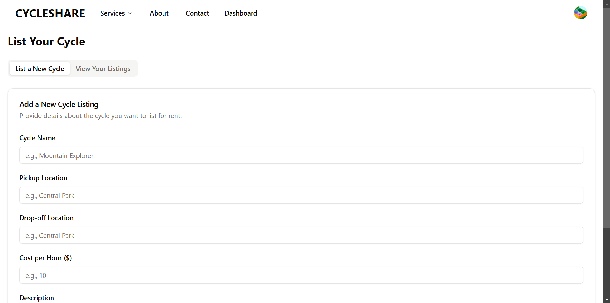

# 🚲 Cycle Share

Cycle Share is a community-driven platform that promotes fitness, affordability, and eco-friendly travel by enabling users to **rent cycles for city travel** or **list their own cycles for others to rent**. Built using the MERN stack (MongoDB, Express, React, Node.js) with Shadcn UI components for a clean, modern experience.

---

## 🔗 Live Demo

> [Link](https://cycle-share.vercel.app/)

---

## 🖼️ Preview

### 🏠 Landing Page  
_A snapshot of the welcoming and informative landing page._

---

### 📊 Dashboard  
_Personalized dashboard showing your rentals, listings, and ride history._

---

### 🚴 Rent a Cycle  
_Search and rent available cycles in your area._

---

### 📝 List a Cycle  
_Earn by listing your own cycle when it’s not in use._

---

## ⚙️ Tech Stack

| Technology    | Purpose                          |
|---------------|----------------------------------|
| **React**     | Frontend library                 |
| **Shadcn/UI** | Modern UI components             |
| **Node.js**   | Backend runtime                  |
| **Express.js**| Server-side framework            |
| **MongoDB**   | NoSQL database for data storage  |
| **Vite**      | Fast development environment     |

---

## ✨ Key Features

### 🌍 Landing Page
- Engaging intro to the platform
- Call-to-actions for renters and listers
- Modern UI with responsive design

### 📋 Dashboard
- View and manage your rentals and listings
- Real-time activity updates
- Clean analytics view

### 🚲 Rent a Cycle
- Location-based cycle search
- Filter by type, price, and availability
- Quick booking with integrated confirmation

### 📤 List Your Cycle
- Easy-to-fill listing form
- Add images, price, availability
- Earn by sharing your unused cycle

---

